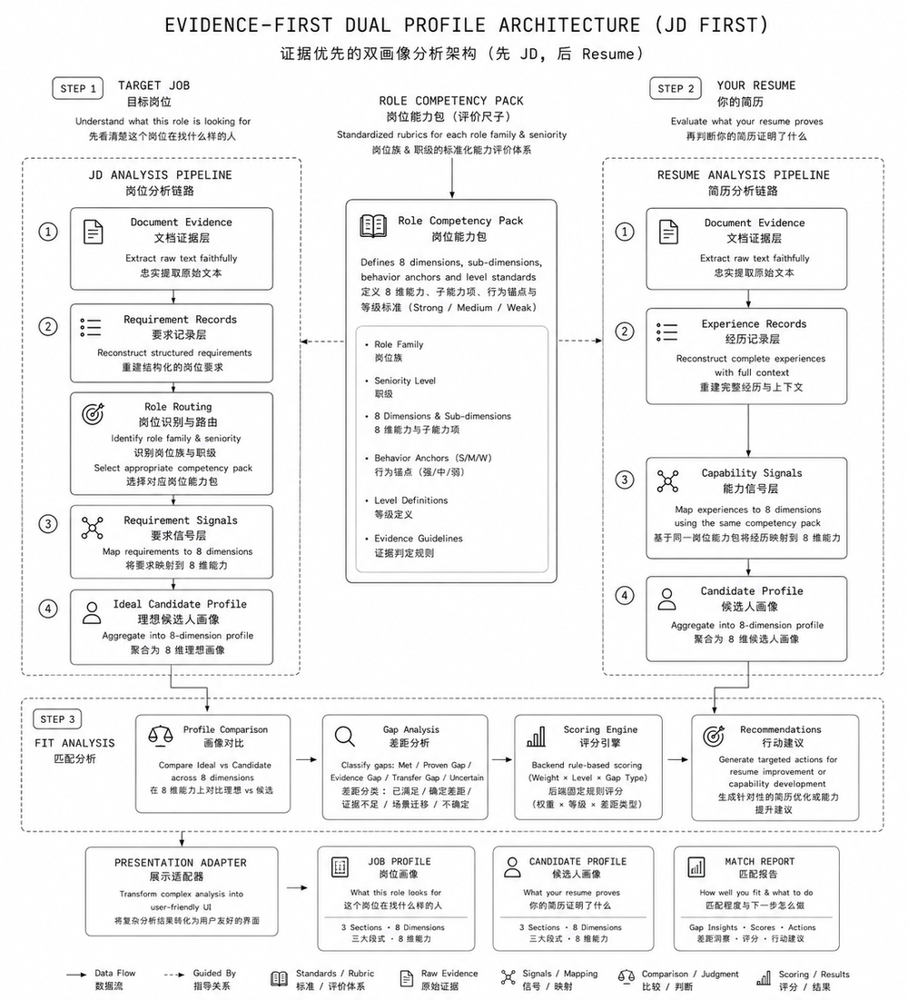

# 工作找你 · Job Seek You

> 一个基于证据的 AI 求职决策工作台：先读懂岗位，再读懂你，然后告诉你该不该投、怎么改。
>
> An evidence-first AI job-decision workbench: understand the role, then your resume, then tell you whether to apply and what to fix.

[English](#english) · [中文](#中文) · 在线体验 / Live: <https://workfindsyou.cn> · 源码 / Source: <https://github.com/Roqi-zhang/Work-finds-YOU>

---

## 中文

### 它解决什么问题

求职者的投递机会是有限的。真正的成本不是「投得少」，而是把时间花在本来就不该投的岗位上，或者投了一个本可以命中、却没把证据写清楚的岗位。

「工作找你」把这件事结构化：先把 JD 翻译成一张能力地图，再把简历翻译成一组可追溯的能力证据，最后逐维比对，给出一个可解释的匹配判断和三步可执行动作。

### 核心功能

| 功能 | 说明 |
|---|---|
| 岗位画像 | 把 JD（文本 / PDF / 截图）解析成 8 维能力要求 + 评价标准，标出硬性要求与关键点 |
| 个人画像 | 把简历翻译成能力证据，每条结论都能回溯到简历原文 |
| 匹配报告 | 匹配分数 + 最大优势 / 最大缺口 / 最大风险 + 投前 3 步（可直接复制的简历改写文案、STAR 面试准备） |
| 岗位比较池 | 多个犹豫中的岗位放在同一张径向图上横向权衡，外圈匹配度低、内圈匹配度高 |
| 投递看板 | 记录投递状态与时间轴，可回看当时的岗位画像 / 个人画像分析快照 |
| 一键导出 | 按网页版式 1:1 导出 PDF / DOCX |

### 最快使用路径（约 5 分钟）

粘贴 JD → 上传简历 → 生成匹配报告 → 看投前 3 步 → 加入比较池 → 记录投递。

### 技术架构



- **前端**：React 18 + Vite 5 + TypeScript + Tailwind + shadcn/ui，Swiss Style 设计系统（`src/styles/swiss.css`）
- **后端**：Lovable Cloud（Postgres + Auth + Storage + Edge Functions），所有业务表按 `auth.uid()` 行级隔离
- **AI**：分阶段调用 + 分层缓存 + 后端确定性算分

```text
src/pages/      Home · Workbench(双画像) · Match · Compare · Delivery · Snapshot · Auth
src/lib/        ai.ts 云函数调用层 · wfy.ts 视图模型 · tasks.ts 跨页任务 · filestore.ts 文档缓存
supabase/functions/
  parse-jd        JD/图片 → 岗位画像（含 OCR 前置、评价标准 rubric）
  parse-resume    简历 → 个人能力画像（证据可追溯）
  run-match       双画像比对 → 匹配报告与投前建议
  claim-guest     访客数据在登录后归属认领
  _shared/        ai 网关 · scoring 算分 · quota 额度 · docstore 缓存 · schemas · adapter · hash
```

### AI 分析管线

两条管线共用四层结构，先 JD 后简历：

1. **Document Evidence 文档证据层** — 忠实提取原文，不改写。
2. **Records 记录层** — JD 侧重建结构化要求，简历侧重建完整经历上下文。
3. **Signals 信号层** — 依据同一套评价标准（rubric）把要求 / 经历映射到 8 个能力维度。
4. **Profile 画像层** — 聚合成理想候选人画像与候选人画像。

匹配阶段做差距分析（已满足 / 确定差距 / 证据不足 / 场景迁移 / 不确定），**分数由后端固定公式合成，模型只负责证据与等级**。因此同一份输入重复运行，分数一致、可追溯、可申诉。

### 模型选型

选型优先级：**① 业务准确率 → ② 模型能力形态是否吻合架构 → ③ 成本与产能**。看任务适配度，而不是通用榜单排名。

#### 两个核心场景的能力画像

| 场景 | 关键能力 | 不重要的能力 |
|---|---|---|
| A · 文件解析与分析（parse-jd / parse-resume） | 多模态读版式（PDF / 截图）、原文忠实不改写、长 Schema 稳定结构化输出、抽取召回率 | 深度推理、创意生成 |
| B · 双画像比对与分析（run-match） | 复杂语义推理、细粒度证据判断、长上下文（双画像 + 全量证据入 prompt）、稳定 JSON | 多模态、极致速度 |

#### 候选模型对比（按本产品任务评价，非通用榜单）

| 模型 | 多模态读文件 | 原文忠实 / 抽取 | 结构化输出稳定性 | 复杂推理 | 长上下文 | 单位成本 | 更适合 |
|---|---|---|---|---|---|---|---|
| Qwen3.7-Plus | A（原生 VL，中文简历版式友好） | A | A | B | B+ | 低 | **A 解析层首选** |
| DeepSeek V4-Pro | 弱 | A | A | A | A | 中低 | **B 匹配层首选** |
| GPT-5.6 系列 | A | A | A（strict schema 最稳） | A | A | 高 | 两层兜底，成本敏感时不作主力 |
| Gemini 3.6 Flash | A（图片 OCR 极快，实测约 2s） | B+ | A | B | A | 极低 | **OCR 前置步骤专用** |
| 豆包视觉版 | A | B+ | B | B | B | 极低 | 高并发降级备选 |
| Kimi 长文本系 | B | A | B+ | B+ | A | 低 | 超长 JD / 简历兜底 |
| Claude 系 | A | A | A | A | A | 高 | 质量对照基线 |

#### 结论

- **A 解析层：Qwen3.7-Plus**，图片 JD 的 OCR 前置步骤用 Gemini 3.6 Flash，GPT-5.6 作兜底。
- **B 匹配层：DeepSeek V4-Pro**，GPT-5.6 作兜底。

以上是基于公开能力评价的**初步选型**，不等于本产品的最优解。最终版本以实测为准，评测方法：同一批真实 JD / 简历样本，评四个指标 —— 证据原文可检索率、8 维等级与人工标注一致率、同输入重复运行的分数方差、单次成本与 P95 延迟。

工程上模型是配置项（`CUSTOM_AI_MODEL` 环境变量 + 各阶段独立指定），换模型不改代码；主模型失败自动切备用。

### 成本控制机制

四层缓存，效果是「同一份简历换一个岗位，只重跑一半」：

1. **文档级去重** — 上传即算 SHA-256，同一份文件全局只登记一次（`documents` 表 + `seen_count`）。
2. **分析级缓存** — 按 `内容哈希 + 阶段 + prompt 版本 + schema 版本 + 作用域` 命中即复用。JD 分析全局共享，简历分析仅限本人作用域。
3. **分层指纹** — `extraction_fingerprint`（与 JD 无关）与 `profiling_fingerprint`（含 rubric 哈希）分离，换 JD 时抽取层直接复用，只重跑画像层，成本约减半。
4. **报告级复用** — 同一「岗位画像 + 个人画像」的匹配报告唯一，重复查看不再调模型、也不扣使用次数；只有画像换版才标记失效并按需重算。

另外，后端确定性算分意味着不需要为了「结果稳定」而重复采样多次。

### 商业模式与试用机制

**当前阶段：前期测试期，全面免费开放试用。**

| 档位 | 权益 |
|---|---|
| 访客（未登录） | 完整跑通一次：岗位分析 + 简历分析 + 匹配报告，并可使用比较池与投递管理 |
| 注册用户 | 每日 20 次分析额度（岗位 / 简历 / 匹配合计），报告永久可查 |
| 付费档 | 页面占位展示，**尚未开放** |

后期商业模式按既定规划：免费档保留基础额度；付费档以会员制提供更高额度、批量岗位横向对比与历史报告长期留存；收款接入国内聚合支付（微信支付 / 支付宝商户），资金直达运营主体账户。

### 本地开发

```bash
git clone https://github.com/Roqi-zhang/Work-finds-YOU.git
cd Work-finds-YOU
npm install
cp .env.example .env   # 填入你自己的后端地址与 publishable key
npm run dev            # http://localhost:8080
npm run test
```

环境变量见 `.env.example`。前端只使用 publishable key；模型密钥等服务端凭据全部通过 Edge Function 环境变量注入，不进仓库。

### License

保留所有权利。本仓库仅供演示与作品集展示，未经许可请勿用于商业用途。

---

## English

### The problem

Job seekers have a limited number of meaningful applications. The real cost isn't applying too little — it's spending time on roles you should never have applied to, or losing a role you could have won because the evidence was never made explicit.

Job Seek You structures that decision: translate the JD into a capability map, translate the resume into traceable capability evidence, compare them dimension by dimension, and return an explainable verdict plus three concrete actions.

### Core features

| Feature | Description |
|---|---|
| Job profile | Parses a JD (text / PDF / screenshot) into 8 capability requirements plus an evaluation rubric, flagging hard requirements and key points |
| Candidate profile | Translates a resume into capability evidence, every claim traceable to the original text |
| Match report | Score + biggest strength / gap / risk + three pre-application actions (copy-ready resume rewrites, STAR interview prep) |
| Comparison pool | Weigh multiple undecided roles on one radial chart — outer ring = weaker fit, inner ring = stronger fit |
| Application board | Track status and timeline, and revisit the profile snapshots as they were at analysis time |
| Export | 1:1 PDF / DOCX export matching the on-screen layout |

### Fastest path (~5 minutes)

Paste a JD → upload your resume → generate the match report → read the three pre-application steps → add to the comparison pool → log the application.

### Architecture


- **Frontend**: React 18 + Vite 5 + TypeScript + Tailwind + shadcn/ui, Swiss-style design system
- **Backend**: Lovable Cloud (Postgres + Auth + Storage + Edge Functions), every business table isolated by `auth.uid()`
- **AI**: staged model calls + layered caching + deterministic server-side scoring

### AI pipeline

Both pipelines share four layers, JD first:

1. **Document Evidence** — verbatim extraction, never paraphrased.
2. **Records** — structured requirements (JD side) and full-context experiences (resume side).
3. **Signals** — map both onto 8 capability dimensions using the same rubric.
4. **Profile** — aggregate into the ideal-candidate profile and the candidate profile.

Matching produces a gap analysis (met / proven gap / evidence gap / transfer gap / uncertain). **The score is computed by a fixed backend formula; the model only supplies evidence and levels** — so repeat runs on the same input are reproducible and auditable.

### Model selection

Priority order: **① business accuracy → ② fit between model capability shape and the architecture → ③ cost and throughput.** Task fit, not leaderboard rank.

| Scenario | What matters | What doesn't |
|---|---|---|
| A · Document parsing | Multimodal layout reading, verbatim fidelity, stable long-schema structured output, extraction recall | Deep reasoning, creativity |
| B · Dual-profile matching | Complex semantic reasoning, fine-grained evidence judgement, long context, stable JSON | Multimodality, raw speed |

| Model | Multimodal | Verbatim / extraction | Structured output | Reasoning | Long context | Unit cost | Best for |
|---|---|---|---|---|---|---|---|
| Qwen3.7-Plus | A | A | A | B | B+ | Low | **Parsing layer (A)** |
| DeepSeek V4-Pro | Weak | A | A | A | A | Low-mid | **Matching layer (B)** |
| GPT-5.6 family | A | A | A (strictest schema) | A | A | High | Fallback for both layers |
| Gemini 3.6 Flash | A (~2s image OCR) | B+ | A | B | A | Very low | **OCR pre-step** |
| Doubao vision | A | B+ | B | B | B | Very low | High-concurrency fallback |
| Kimi long-context | B | A | B+ | B+ | A | Low | Very long documents |
| Claude family | A | A | A | A | A | High | Quality baseline |

**Conclusion:** Qwen3.7-Plus for parsing (Gemini 3.6 Flash for the OCR pre-step), DeepSeek V4-Pro for matching, GPT-5.6 as fallback. This is a *preliminary* selection from published capability data — the final choice is decided by task-specific evaluation on real JD/resume samples across four metrics: evidence retrievability, agreement with human dimension labels, score variance across repeated runs, and per-run cost / P95 latency. Models are configuration (`CUSTOM_AI_MODEL` plus per-stage overrides), so switching requires no code change, with automatic fallback on failure.

### Cost control

1. **Document dedup** — SHA-256 on upload; a given file is registered once globally.
2. **Analysis cache** — keyed by content hash + stage + prompt version + schema version + scope. JD analyses are shared globally; resume analyses stay scoped to their owner.
3. **Layered fingerprints** — extraction (JD-independent) and profiling (rubric-bound) are separate, so switching the target job re-runs only half the pipeline.
4. **Report reuse** — one report per (job profile, candidate profile) pair; re-viewing costs no model call and no quota.

### Business model

**Current stage: open free trial.** Guests can complete one full run without signing in; registered users get 20 analyses per day (job + resume + match combined); paid tiers are placeholders and **not yet enabled**. The planned model is membership-based higher quotas, batch role comparison, and long-term report retention, with payments via Chinese aggregate payment providers (WeChat Pay / Alipay merchant).

### Local development

```bash
git clone https://github.com/Roqi-zhang/Work-finds-YOU.git
cd Work-finds-YOU
npm install
cp .env.example .env
npm run dev   # http://localhost:8080
npm run test
```

Only publishable keys live in the frontend; all server-side credentials are injected as Edge Function secrets and are never committed.

### License

All rights reserved. This repository is published for demonstration and portfolio purposes.
